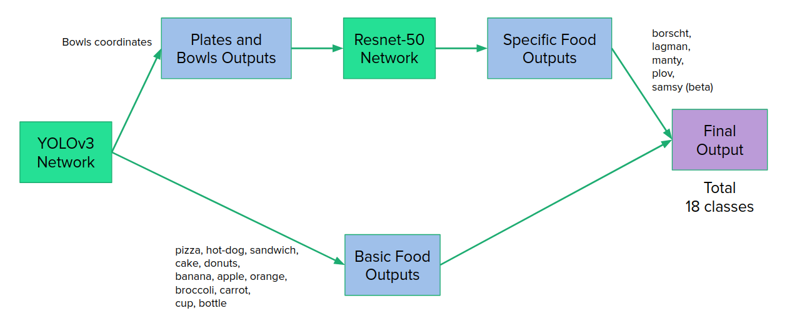

## Food Detector


A custom model to detect local food using two CNN models YOLOv3 and custom ResNet-50.
YOLOv3 model was pretrained on COCO Dataset and ResNet-50 was pretrained on Imagenet and finetuned for the custom dataset of local food that was manually collected from Google Images with Python and Javascript.

## Installation
### Docker
If you don't want to deal with packages, install with Docker Compose
```bash
docker-compose up --build
```
And run shell in the container with
```bash
docker-compose run food-detector bash
```

### Pip
If you want to install with pip instead of Docker
```bash
pip install -r requirements.txt
```

## Usage

Basic usage with a local image file
```bash
python food-detector.py --file <path to image file>
```
For example:
```bash
python food-detector.py --file test_images/test0.jpg
```
By default the application saves images with prediction in 'predictions' folder

To predict food in the image from internet use -u or --url flag
```bash
python food-detector --url <url of image>
```
There are other flags to print outputs, to save predicted images, to set a threshold 
Run -h or --help to get the additional information
```bash
python food-detector --help
```
